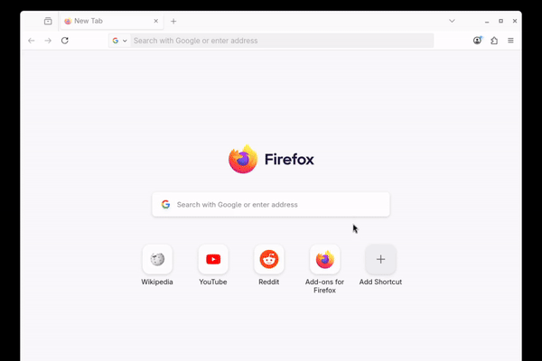

# search-lcsc
This add-on adds a search engine to the browser that lets you search
[www.lcsc.com](https://www.lcsc.com) directly from the address bar.
By typing keywords such as `@lcsc 0603 10k`, you can quickly search
for parts on LCSC.

You can install this add-on from [this page](https://addons.mozilla.org/ja/firefox/addon/search-lcsc/).

## Advanced usage
This add-on is also useful for searching by LCSC part numbers.
If a valid LCSC part number is provided, LCSC will redirect
to the corresponding part page.

https://github.com/user-attachments/assets/ef8c4b5a-e53b-445c-8a43-28f76c932708

## License
This add-on is developed by extending discogs-search add-on in
[webextensions-examples](https://github.com/mdn/webextensions-examples/),
which is distributed under the Mozilla Public License 2.0, a weak copyleft license.
To comply with the copyleft requirements, this add-on is also licensed
under the Mozilla Public License 2.0.

For the full license text, see the LICENSE file.
